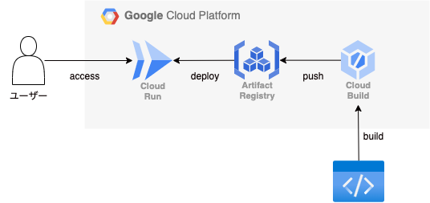

# TerraformでGCP Cloud RunにNginxをデプロイ

このプロジェクトでは、Terraformを使用してGoogle Cloud Platform (GCP) のCloud RunにNginxをデプロイする方法を説明します。

<p align="center">
  
</p>

## 前提条件

+ Google Cloud Platform (GCP) のアカウント
+ gcloud CLI のインストールと設定済み (gcloud auth application-default login 実行済み)
+ Terraformのインストール
+ GCPプロジェクトが作成済みで、課金が有効になっていること

## 起動方法

### 1. 環境ごとのtfvars作成

```
bin/make_tfvars
```

### 2. Terraform の適用

```
bin/terraform_apply
```

### 3. デプロイの確認

Terraformの出力で示されたURLをブラウザで開き、Nginxのデフォルトページが表示されることを確認してください。

### 4. Terraform の削除

```
bin/terraform_destroy
```
